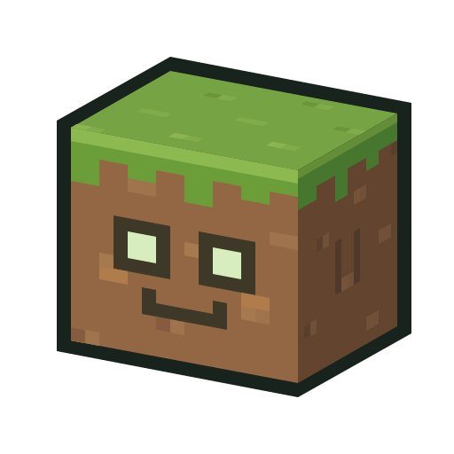

<p align="center">
  
</p>

<h1 align="center">CraftGPT</h1>

<p align="center"><strong>Describe a build. Preview it. Make it part of your world.</strong></p>

<p align="center">
  <a href="https://github.com/LivingPixel-pixel/CraftGPT/releases/tag/v1.0.0">Download v1 prerelease</a> &middot;
  <a href="#getting-started">Install and set up</a> &middot;
  <a href="https://github.com/LivingPixel-pixel/CraftGPT/issues">Report a bug</a> &middot;
  <a href="docs/RELEASE_1.0.0.md">Release notes</a>
</p>

<p align="center">Minecraft Java 26.1.2 &middot; Fabric &middot; v1.0.0 experimental prerelease</p>

**Released without extensive in-game testing.** Automated builds and tests passed, but gameplay, dedicated servers, resource packs, modpack compatibility and world recovery have not been extensively verified. Use a disposable world and keep backups. The v1 label marks our development baseline, not a stability guarantee.

Day-to-day improvements target Minecraft **26.1.2**. Other Minecraft versions receive ports at major releases. See the [version and release policy](docs/COMPATIBILITY.md) and [completed automated checks](docs/V1_VALIDATION.md).

CraftGPT is a Fabric mod for AI-assisted building inside Minecraft. Select an area, describe your idea in the CraftBook, and inspect the generated draft. Ask for changes, then place it when you are happy with it.

Generation uses your locally installed, signed-in Codex CLI or a configured API provider. Account limits and API charges apply. There is no separate CraftGPT backend to set up.

Generated beds, chests and furnaces are not supported yet. See [what is still rough](#what-is-still-rough) before trying it in an existing world.

## What you can do

- Use the CraftBook to select an area, write a prompt, review a draft and place it. Commands are still available.
- Build through your locally installed Codex, or configure an API endpoint and key in the settings.
- Choose models, including GPT-6 Astra, and adjust reasoning and generation effort.
- Ask for changes to a draft or target a smaller part of it without replacing everything.
- Inspect a solid preview. With higher effort, the model gets textured exterior views and cutaways to review its work.
- Keep playing while generation runs, then check its progress, chat and diagnostic logs.
- Revisit saved plans and use placement history and undo.

The model chooses the materials. Local code expands geometry and checks the result; it does not quietly swap the palette for a default set of blocks.

## Getting started

You need Minecraft Java Edition **26.1.2**, Fabric Loader **0.19.3 or newer**, and Fabric API. The current build uses Fabric API **0.154.0+26.1.2** and Java **25**.

1. Download the CraftGPT JAR for your exact Minecraft version from [the v1 prerelease](https://github.com/LivingPixel-pixel/CraftGPT/releases/tag/v1.0.0). Minecraft 26.1.2 is the primary build; the other files are experimental major-release ports.
2. Put it and the matching Fabric API JAR in your Minecraft instance's `mods` folder. Remove any older CraftGPT JAR first.
3. Launch Fabric and open a test world. For a dedicated server, install CraftGPT and Fabric API on both the server and client. Server permissions still apply.
4. Run `/craftgpt book` and right-click the CraftBook.
5. Open settings and choose your generation setup.

### Codex

Install Codex locally and sign in with an account that has Codex access. CraftGPT uses the local Codex CLI, not browser automation. The Windows desktop installation can be discovered automatically; other installations need the CLI available to the Minecraft process.

There is no separate CraftGPT backend or skill download to set up. Generation still uses your account's model access and usage limits. It is not unlimited free AI.

### API

Enter your API endpoint and key, then choose planning and building models. API calls are billed by your provider. Model presets do not guarantee that a particular account can use every model.

## Your first build

1. Mark two opposite corners of a small area with the CraftBook.
2. Describe a simple build, for example: "A small oak shelter with a stone floor, a door and two windows."
3. Start with effort 1 for a quick draft. Higher effort allows additional visual review rounds.
4. Inspect the preview. Ask for a change if needed, or place it when you are happy with it.

Nothing in the draft is placed just because generation finishes. Placement requires your confirmation.

If you prefer commands:

```text
/craftgpt setArea start
/craftgpt setArea stop
/craftgpt prompt A small oak shelter with a stone floor
/craftgpt preview
/craftgpt place
/craftgpt undo
```

Run `/craftgpt` for help. Settings, saved plans and placement history are also available through the book.

## What is still rough

The main workflow is implemented, but build quality varies. More review rounds can help; they do not guarantee a better design.

- Generated block entities are currently blocked. This includes real beds, chests and furnaces. The prompts require the model to disclose that limitation instead of passing off wool furniture or a stone cube as a working survival block.
- The textured inspection renderer is not an exact copy of the in-game view. Lighting, animated textures, special renderers and some resource packs can differ.
- The optional browser preview is approximate. Use the in-game inspection when judging materials and block shapes.
- Automated checks cover generation, validation, placement logic and the portable preview. One test uses a private local replay fixture and is skipped in a fresh checkout. Live testing across worlds, resource packs and server setups is still needed.
- Model access, generation time and reliability depend on the selected provider and account.

Please do not rely on undo as your only backup. The [live test checklist](docs/LIVE_TESTS_0.19.0-alpha.1.md) covers the cases that still need hands-on testing.

## Privacy and local files

CraftGPT stores settings, requests, build history and logs locally. There is no CraftGPT-hosted service.

Local-first does not mean offline: when you generate, your prompt and selected block context are sent through Codex or your configured API provider. Visual review also sends rendered images. Codex keeps its own local session history.

API keys are stored locally in `config/craftgpt/client-secrets.properties`. Treat that file as a secret. Do not upload your entire config or request folder when reporting a bug. Logs and exports can contain your prompts and build context.

## Building from source

Install JDK 25, then run from `fabric-mod`. These commands build the primary Minecraft **26.1.2** version:

```powershell
.\gradlew.bat test build
```

On Linux or macOS:

```sh
./gradlew test build
```

The first build downloads dependencies. The primary JAR is written to `fabric-mod/build/26.1.2/libs/`.

To copy a versioned JAR into the separate release folder:

```powershell
.\gradlew.bat packageRelease
```

The v1 build is copied to `releases/1.0.0/CraftGPT-1.0.0-mc26.1.2.jar`, alongside a SHA-256 checksum. Packaging does not publish a GitHub release.

For a major release port, select an exact Minecraft target, for example:

```powershell
.\gradlew.bat test packageRelease "-PmcTarget=1.20.1"
```

Minecraft 1.x targets also require an installed **JDK 21**, including 1.20.1. Follow the [compatibility build instructions](docs/COMPATIBILITY.md) for the full release matrix and Fabric dependency checks.

The small portable-preview check needs Node.js:

```sh
node tools/test-portable-viewer.cjs
```

## Project layout

- `fabric-mod/`: mod source, tests and Gradle build.
- `docs/`: implementation notes, release notes and manual test checklists.
- `codex-skills/`: optional manual export workflow. Not required by the in-game Codex integration.
- `releases/`: local versioned build output. Downloadable JARs are published as GitHub release assets, not committed to Git.

## Contributing

Bug reports with a small reproducible example are especially useful. Include the mod version, Minecraft/Fabric versions, model and effort setting, what you asked for, and what happened. Redact private details before attaching logs.

See [CONTRIBUTING.md](CONTRIBUTING.md) for build and testing notes.

## License

CraftGPT code is released under the [MIT License](LICENSE). Minecraft assets and third-party dependencies retain their own licenses. Minecraft textures are read from your installation at runtime, not distributed as a texture pack with this mod.

CraftGPT is an independent project, not an official Minecraft or OpenAI product. It is not affiliated with Mojang, Microsoft or OpenAI.
